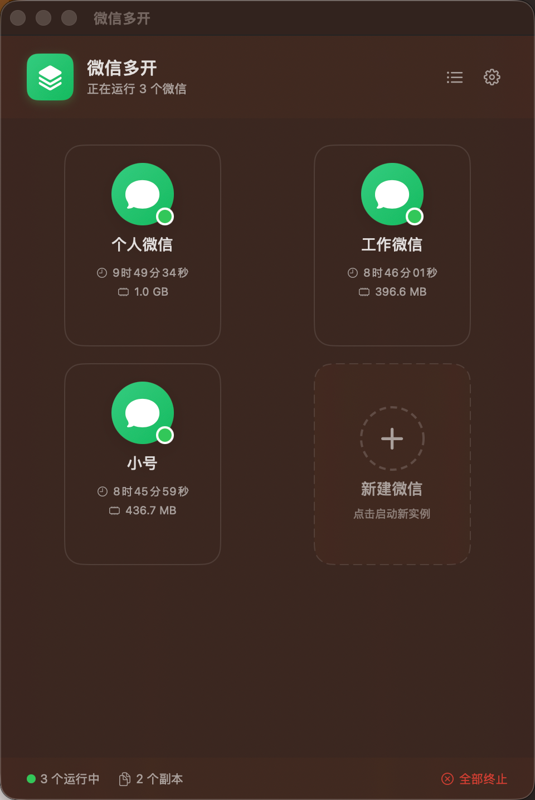
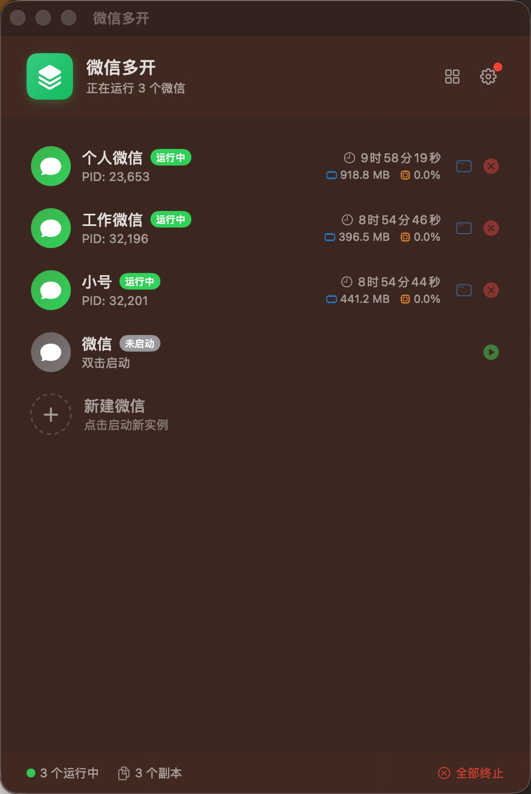
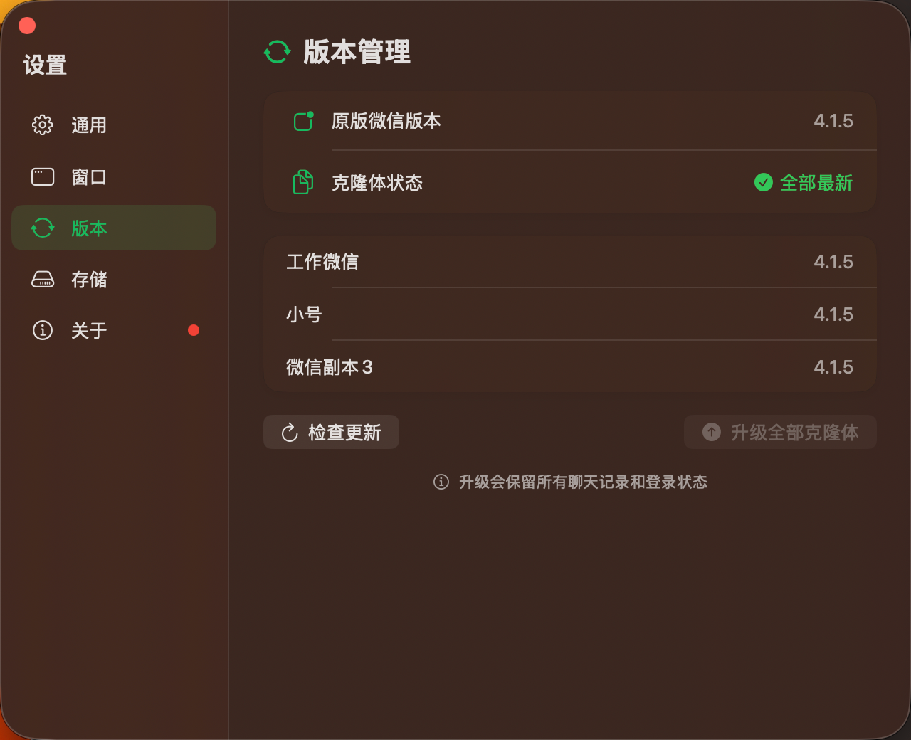
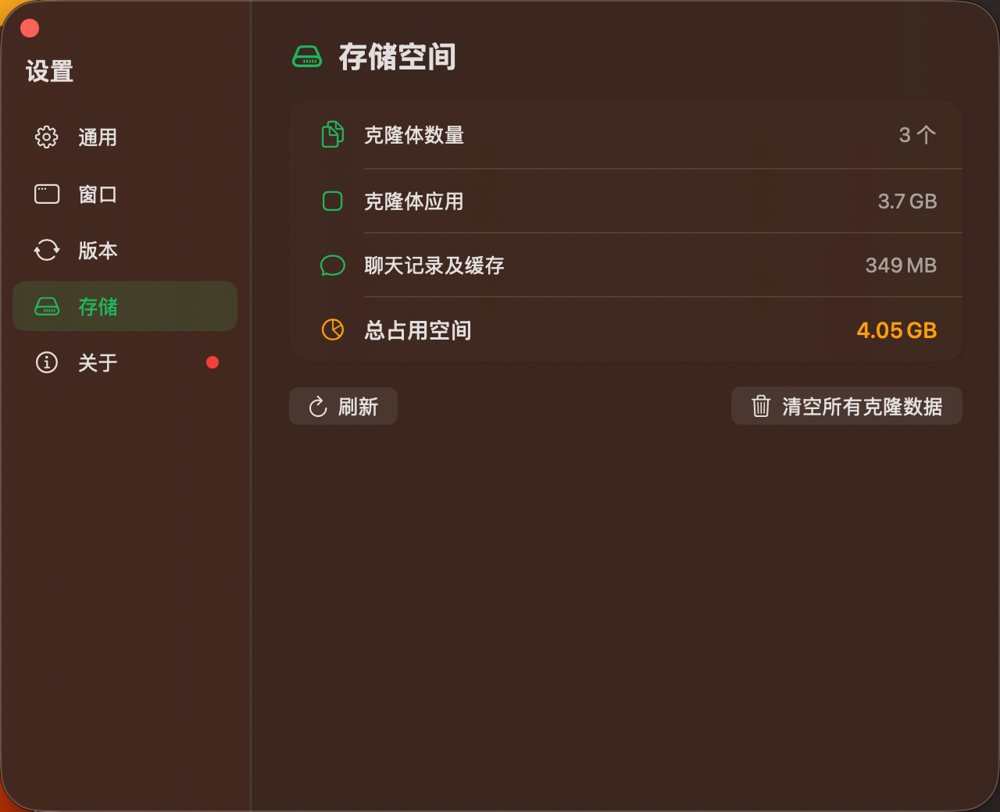

# 微信多开

一款 macOS 平台的微信多开助手，支持同时运行多个微信实例。


## 界面预览

<table>
  <tr>
    <td align="center"><br/><b>卡片视图</b></td>
    <td align="center"><br/><b>列表视图</b></td>
  </tr>
  <tr>
    <td align="center"><br/><b>版本管理</b></td>
    <td align="center"><br/><b>存储空间</b></td>
  </tr>
</table>

## 功能特性

### 核心功能
- **多实例运行** - 支持同时运行多个独立的微信实例
- **自动创建副本** - 自动复制微信应用并修改 Bundle ID，实现多开
- **数据完全隔离** - 每个实例拥有独立的聊天记录、登录状态和缓存数据

### 实例管理
- **双视图模式** - 支持卡片视图和列表视图，自由切换
- **一键启动/终止** - 快速启动或终止任意微信实例
- **窗口激活** - 快速将指定微信窗口带到前台（支持最小化和后台状态）
- **自定义名称** - 为每个实例设置自定义名称，便于区分
- **实时状态** - 显示运行时长、内存占用、CPU 使用率

### 版本管理
- **版本检测** - 自动检测原版微信和克隆体的版本差异
- **一键升级** - 当原版微信更新后，可一键升级所有克隆体
- **保留数据** - 升级过程保留所有聊天记录和登录状态

### 存储管理
- **空间统计** - 统计所有克隆体占用的磁盘空间（应用 + 数据）
- **一键清理** - 支持清空所有克隆体及其数据

### 系统集成
- **菜单栏快捷操作** - 在菜单栏快速访问常用功能
- **开机自启** - 支持登录时自动启动
- **窗口行为** - 可配置关闭窗口时隐藏到菜单栏
- **自动更新** - 支持检测新版本并提示更新

## 系统要求

- macOS 13.0 (Ventura) 或更高版本
- 已安装微信 Mac 版

## 安装方法

### 方式一：直接下载
1. 前往 [Releases](https://github.com/yanjunhui/WeChatMulti/releases) 页面
2. 下载最新版本的 `WeChatMulti_vX.X.X.dmg` 文件
3. 打开 DMG，将「微信多开」拖入「应用程序」文件夹
4. 双击打开应用即可使用

### 方式二：源码编译
```bash
git clone https://github.com/yanjunhui/WeChatMulti.git
cd WeChatMulti
open WeChatMultiOpen.xcodeproj
```
在 Xcode 中编译运行即可。

> 本应用已通过 Apple 开发者证书签名并完成公证（Notarization），可直接运行，无需额外安全设置。

## 使用说明

1. **启动应用** - 打开「微信多开」应用
2. **启动微信** - 点击「新建微信」按钮
   - 首次点击：如果没有任何微信在运行，会启动原版微信
   - 再次点击：会自动创建并启动新的微信副本
3. **管理实例** - 在列表中可以：
   - 悬停显示操作按钮：启动/停止
   - 单击/双击：激活对应微信窗口
   - 右键菜单：重命名、复制 PID、终止实例等

## 工作原理

微信 Mac 版使用单实例检测机制，本应用通过以下方式实现多开：

1. 复制微信应用到独立目录
2. 修改副本的 Bundle Identifier
3. 使用 ad-hoc 签名重新签署副本
4. 每个副本拥有独立的沙盒容器，数据完全隔离

## 更新日志

### v1.0.3 (2024-12-08)
- 优化实例卡片交互体验
- 启动/停止按钮移至图标中央，悬停时显示
- 添加平滑的按钮过渡动画
- 修复创建实例时图标闪烁问题
- 修复后台检查更新的线程安全问题

### v1.0.2 (2024-12-07)
- 重构 UI 为卡片视图，支持列表/卡片切换
- 添加更新检测小红点提示
- 优化设置窗口交互

### v1.0.1 (2024-12-06)
- 修复设置窗口无法关闭的问题
- 统一更新检测的交互体验
- 更新应用名称为「微信多开」

### v1.0.0 (2024-12-05)
- 首次发布
- 支持微信多开核心功能
- 版本管理和存储空间管理
- 菜单栏快捷操作

## 免责声明

本应用只是为了方便启动多个微信，仅仅是对微信应用做了一个完整复制，没有对微信程序本身做任何修改，而且多个克隆体之间完全数据隔离，理论上没有任何安全风险。

但是最终解释权归腾讯所有，个人不承担任何账号安全相关责任，如有侵权，请联系 i@yanjunhui.com，我将立即删除！

## 开源协议

本项目采用 [Unlicense](LICENSE) 协议，您可以自由使用、修改和分发。

## 作者

Yanjunhui

---

**注意**：本应用仅供学习交流使用，请遵守微信的使用条款。
